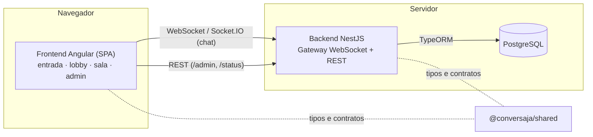
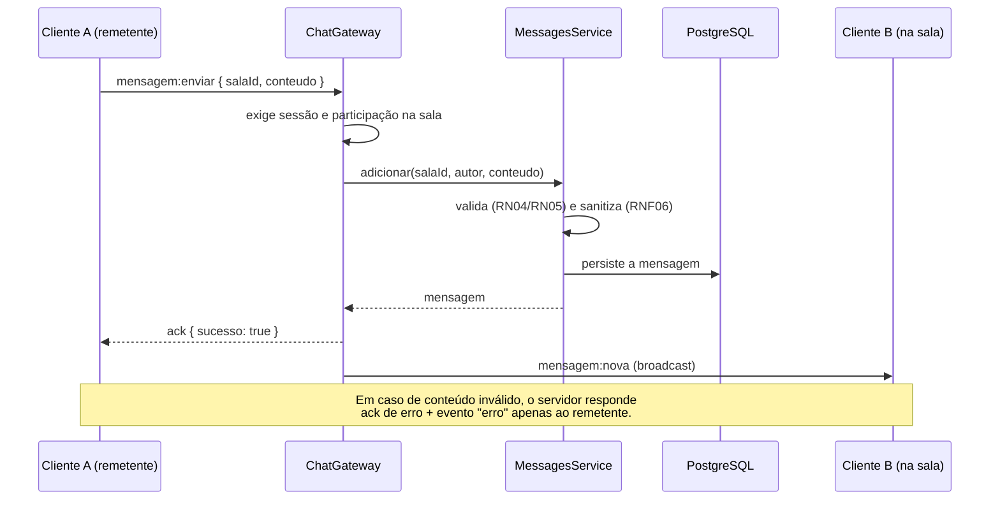
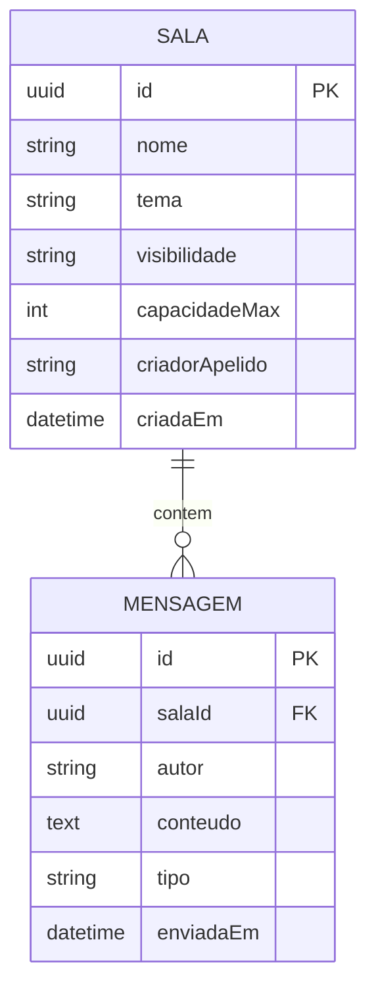
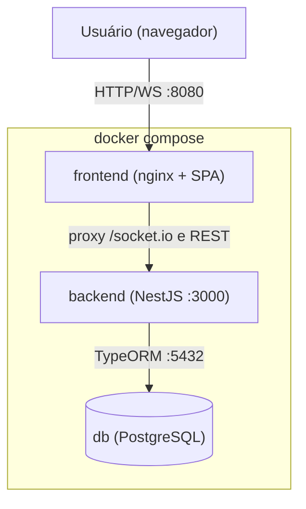

# Documento de Arquitetura — ConversaJá

Este documento descreve a estrutura geral do ConversaJá, seus principais componentes, as formas
de comunicação entre eles e as decisões arquiteturais mais relevantes. Complementa a
especificação de requisitos em [requisitos/](requisitos/) e a estratégia de implementação e
testes em [IMPLEMENTACAO.md](IMPLEMENTACAO.md).

## 1. Visão geral

O ConversaJá é uma aplicação Web de chat em tempo real. O usuário acessa pelo navegador,
identifica-se com um apelido, entra em salas temáticas e troca mensagens entregues
instantaneamente a todos os participantes. O sistema é composto por:

- um **frontend** Angular (SPA) que roda no navegador;
- um **backend** NestJS que expõe um **gateway WebSocket** (tempo real) e uma **API REST**
  (status e administração);
- um banco **PostgreSQL** para os dados duráveis (salas e mensagens);
- um pacote de **contratos compartilhados** (`@conversaja/shared`) usado pelos dois lados.



## 2. Estilo arquitetural e justificativa

Adotou-se uma **arquitetura monolítica modular**: um único backend, organizado internamente em
módulos de domínio coesos e fracamente acoplados. Não se optou por microsserviços.

**Por quê:**

- O escopo gira em torno de **uma funcionalidade central** (chat em tempo real), não de domínios
  independentes que justifiquem deploys separados.
- A **equipe é pequena** e o prazo é o da disciplina: um único artefato é mais simples de
  desenvolver, testar e implantar.
- Microsserviços trariam custo de orquestração, comunicação entre serviços e operação sem
  benefício real neste porte.

A modularidade interna preserva a manutenibilidade (RNF09): cada domínio evolui isolado, e o
estado em tempo real fica concentrado no servidor, facilitando o broadcast.

O código vive em um **monorepo** com npm workspaces, o que permite **compartilhar contratos**
(eventos, DTOs, enums e limites de negócio) entre cliente e servidor em um único lugar, evitando
divergência.

```
conversaja/
├── apps/
│   ├── frontend/   # Angular — UI e cliente WebSocket/REST
│   └── backend/    # NestJS  — gateway WebSocket + REST + persistência
├── packages/
│   └── shared/     # contratos compartilhados (fonte única de verdade)
└── docs/           # requisitos, arquitetura, implementação, protótipos
```

## 3. Componentes principais

### 3.1. Frontend (Angular)

SPA com componentes *standalone* e detecção de mudanças *zoneless* baseada em **signals**.

| Componente / serviço | Responsabilidade | Requisitos |
|----------------------|------------------|------------|
| `features/entrada`   | Identificação por apelido | RF01 |
| `features/lobby`     | Listar e criar salas | RF02, RF04 |
| `features/sala`      | Chat em tempo real, online, "digitando…", moderação | RF03, RF05–RF13 |
| `features/admin`     | Painel administrativo (token, métricas, CRUD oficiais) | RF14, RF15 |
| `core/SocketService` | Encapsula a conexão Socket.IO; expõe `emit` (com ack) e `on` (streams) | — |
| `core/SessionService`| Guarda o apelido da sessão | RF01 |
| `core/AdminApiService` | Cliente REST do painel admin, autenticado por token | RF14, RF15 |
| `core/authGuard`     | Impede acesso ao lobby/sala sem apelido | RF01 |

Os componentes não falam diretamente com o socket: usam o `SocketService`, tipado pelos
contratos de `@conversaja/shared`.

### 3.2. Backend (NestJS)

Organizado em três módulos:

**ChatModule** — núcleo de tempo real:

| Provider | Responsabilidade |
|----------|------------------|
| `ChatGateway` | Traduz eventos WebSocket em operações de domínio e faz o broadcast |
| `SessionService` | Apelidos conectados e unicidade (RN01); total online (RF15) |
| `RoomsService` | Salas + presença online; RN03, RN06, RN07, RN08 |
| `MessagesService` | Conteúdo das mensagens; RN04, RN05, sanitização (RNF06) |
| `MaintenanceService` | Varredura periódica de salas ociosas (RN07) |
| `SalaStore` / `MensagemStore` | Abstrações de persistência (ver §6) |

**AdminModule** — administração (REST):

| Provider | Responsabilidade |
|----------|------------------|
| `AdminController` | Rotas `/admin/*` (métricas e CRUD de salas oficiais) |
| `AdminService` | Regras de RF14/RF15; dispara broadcast ao lobby após mudanças |
| `AdminGuard` | Autenticação por token (`x-admin-token` / `ADMIN_TOKEN`) |
| `DomainExceptionFilter` | Converte erros de negócio em respostas HTTP 400/404 |

**DatabaseModule** — conexão TypeORM/PostgreSQL.

### 3.3. Pacote compartilhado (`@conversaja/shared`)

Fonte única de verdade dos contratos: nomes de eventos WebSocket (`ClientEvents`/`ServerEvents`),
formatos de *payload*, enums de domínio (`Papel`, `Visibilidade`, `TipoMensagem`) e os limites das
regras de negócio (`LIMITES`, `APELIDO_REGEX`). Importado por frontend e backend.

## 4. Formas de comunicação

### 4.1. Tempo real — WebSocket (Socket.IO)

O coração do sistema. O cliente emite eventos e o servidor faz *broadcast* para os participantes
da sala. Os nomes vivem em `@conversaja/shared`. Resumo:

| Direção | Evento | Finalidade |
|---------|--------|------------|
| Cliente → Servidor | `auth:entrar`, `sala:listar/criar/entrar/sair` | sessão e salas |
| Cliente → Servidor | `mensagem:enviar`, `mensagem:digitando` | envio e indicador |
| Cliente → Servidor | `moderacao:remover`, `moderacao:expulsar` | moderação |
| Servidor → Cliente | `mensagem:nova`, `sala:historico`, `sala:participantes` | conteúdo da sala |
| Servidor → Cliente | `sala:lista`, `sala:aviso`, `mensagem:digitando:status` | lobby e presença |
| Servidor → Cliente | `mensagem:removida`, `moderacao:expulso`, `erro` | moderação e erros |

As operações que precisam de confirmação usam o **ack** do Socket.IO: o handler devolve
`{ sucesso: true, dados }` ou `{ sucesso: false, erro }`.

### 4.2. REST

- `GET /status` — saúde do serviço e limites de negócio.
- `/admin/*` — métricas e CRUD de salas oficiais, protegido pelo `AdminGuard`.

### 4.3. Em produção — mesma origem via nginx

No Docker, o nginx serve a SPA e encaminha `/socket.io` para o backend, de modo que frontend e
backend ficam na **mesma origem** (sem CORS, tráfego sobre HTTPS/WSS — RNF06).

## 5. Fluxo crítico — envio de mensagem (RF05/RF06)



## 6. Persistência — durável vs. efêmero

Decisão central de modelagem: **separar o que é durável do que é efêmero**.

- **Durável (PostgreSQL via TypeORM):** salas e mensagens.
- **Efêmero (memória, atrelado às conexões):** sessões de apelido e **presença online** por sala
  (quem está conectado agora), além dos bloqueios temporários de reingresso (RN06) e do
  cronômetro de ociosidade (RN07).

Isso é coerente com a natureza de tempo real: "quem está online" só faz sentido enquanto há
conexão. O papel de moderador é derivado do criador da sala (RN03), persistido junto da sala.



### Padrão de repositório

O acesso a dados é abstraído por `SalaStore` e `MensagemStore` (classes abstratas usadas como
*tokens* de injeção). Há duas implementações:

- **TypeORM** — usada em produção (liga-se ao PostgreSQL);
- **em memória** — usada nos testes.

Assim os testes unitários e o e2e de fluxo rodam **sem banco**, e trocar a tecnologia de
persistência não afeta a lógica de domínio (RNF09).

## 7. Decisões arquiteturais relevantes

| # | Decisão | Motivo |
|---|---------|--------|
| 1 | **Monolito modular** (não microsserviços) | Escopo de uma feature central; equipe pequena; menor custo operacional |
| 2 | **Monorepo (npm workspaces)** | Compartilhar contratos cliente↔servidor numa fonte única |
| 3 | **WebSocket via Socket.IO** | Tempo real bidirecional com *rooms*, *acks* e reconexão automática (RNF08) |
| 4 | **TypeORM + PostgreSQL** | Persistência madura em TS, sem binários externos de *engine*; `synchronize` agiliza o escopo |
| 5 | **Padrão de repositório (stores)** | Testes sem banco e baixo acoplamento à persistência |
| 6 | **Presença/sessão em memória** | Estado de tempo real é efêmero por natureza; simplicidade e desempenho |
| 7 | **Admin por token** (não contas completas) | "Painel administrativo simples" do escopo, sem inflar complexidade |
| 8 | **Angular zoneless + signals** | Modelo de reatividade moderno, simples para streams WebSocket |
| 9 | **nginx servindo a SPA + proxy WS** | Mesma origem em produção; HTTPS/WSS; sem CORS |

## 8. Qualidade, implantação e atributos não funcionais

- **Testes** em vários níveis (unitário, e2e de fluxo WebSocket, componente) — ver
  [IMPLEMENTACAO.md](IMPLEMENTACAO.md). Rodam sem banco graças ao padrão de repositório.
- **CI** (GitHub Actions): lint, testes, e2e e build a cada push/PR.
- **Implantação** por terceiros via **Docker Compose** (banco + backend + frontend).
- **Segurança** (RNF06): sanitização de conteúdo contra XSS e tráfego sobre HTTPS/WSS.
- **Confiabilidade** (RNF08): reconexão automática do cliente Socket.IO.
- **Manutenibilidade** (RNF09): módulos coesos, contratos compartilhados e persistência abstraída.


